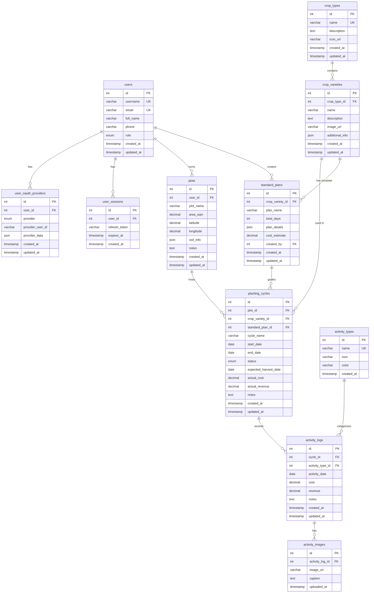

# Smart Farm Database - ER Diagram & Relationships

## Database Schema Overview

ระบบฐานข้อมูลประกอบด้วย **11 ตาราง** แบ่งเป็น 3 กลุ่มหลัก:

### 1. User Management (การจัดการผู้ใช้)
- `users` - ข้อมูลผู้ใช้หลัก
- `user_oauth_providers` - OAuth Providers (Line, Google, Facebook)
- `user_sessions` - Refresh Tokens

### 2. Master Data (ข้อมูลหลัก)
- `crop_types` - ประเภทพืช
- `crop_varieties` - สายพันธุ์พืช
- `activity_types` - ประเภทกิจกรรม
- `standard_plans` - แผนการปลูกมาตรฐาน

### 3. Operational Data (ข้อมูลการใช้งาน)
- `plots` - แปลงเกษตร
- `planting_cycles` - รอบการเพาะปลูก
- `activity_logs` - บันทึกกิจกรรม
- `activity_images` - รูปภาพกิจกรรม

---

## Entity Relationship Diagram



---

## Detailed Relationships

### 1:N Relationships

#### `users` → `plots` (1:N)
- ผู้ใช้ 1 คน สามารถมีหลายแปลงได้
- แปลง 1 แปลง มีเจ้าของเพียง 1 คน
- **Cascade Delete**: ถ้าลบ User → Plots ทั้งหมดจะถูกลบตาม

#### `users` → `user_oauth_providers` (1:N)
- ผู้ใช้ 1 คน สามารถเชื่อมหลาย OAuth Provider ได้ (Line + Google + Facebook)
- Provider record 1 รายการ ผูกกับ User เพียง 1 คน
- **Cascade Delete**: ถ้าลบ User → OAuth records ถูกลบตาม

#### `plots` → `planting_cycles` (1:N)
- แปลง 1 แปลง สามารถมีหลายรอบการปลูกได้ (ต่างช่วงเวลา)
- รอบการปลูก 1 รอบ อยู่ใน 1 แปลง
- **Cascade Delete**: ถ้าลบ Plot → Cycles ทั้งหมดถูกลบตาม

#### `crop_varieties` → `planting_cycles` (1:N)
- สายพันธุ์ 1 สายพันธุ์ ถูกใช้ในหลายรอบการปลูกได้
- รอบการปลูก 1 รอบ ใช้ 1 สายพันธุ์
- **No Cascade**: ถ้าลบ Variety → Cycles **ไม่ถูกลบ** (เก็บประวัติไว้)

#### `planting_cycles` → `activity_logs` (1:N)
- รอบการปลูก 1 รอบ มีหลายกิจกรรม
- กิจกรรม 1 รายการ อยู่ใน 1 รอบ
- **Cascade Delete**: ถ้าลบ Cycle → Activities ทั้งหมดถูกลบตาม

#### `activity_logs` → `activity_images` (1:N)
- กิจกรรม 1 รายการ มีหลายรูปภาพได้
- รูปภาพ 1 รูป อยู่ใน 1 กิจกรรม
- **Cascade Delete**: ถ้าลบ Activity → Images ทั้งหมดถูกลบตาม

---

## JSON Column Details

### 1. `user_oauth_providers.provider_data`

**โครงสร้าง**:
```json
{
  "displayName": "สมชาย ใจดี",
  "email": "user@example.com",
  "pictureUrl": "https://profile.line-scdn.net/xxxxx",
  "statusMessage": "เกษตรกรมืออาชีพ"
}
```

**ประโยชน์**: เก็บข้อมูล Profile จาก OAuth Provider ไว้สำรอง (กรณี Provider เปลี่ยน API)

---

### 2. `plots.soil_info`

**โครงสร้าง**:
```json
{
  "ph": 6.5,
  "type": "ดินร่วน",
  "drainage": "ดี",
  "organic_matter": "ปานกลาง",
  "notes": "เหมาะสำหรับปลูกผลไม้"
}
```

**ประโยชน์**: ข้อมูลดินแต่ละแปลงอาจแตกต่างกัน ไม่จำเป็นต้องสร้างตารางแยก

---

### 3. `crop_varieties.additional_info`

**โครงสร้าง**:
```json
{
  "growing_days_min": 90,
  "growing_days_max": 120,
  "suitable_temp": "25-35°C",
  "water_frequency": "ทุกวัน",
  "fertilizer_type": "15-15-15",
  "common_pests": ["เพลี้ยอ่อน", "หนอนเจาะผล"]
}
```

**ประโยชน์**: แต่ละพันธุ์พืชมีคุณสมบัติเฉพาะที่แตกต่างกัน JSON ทำให้ยืดหยุ่น

---

### 4. `standard_plans.plan_details`

**โครงสร้าง**:
```json
{
  "milestones": [
    {
      "day": 1,
      "activity": "เตรียมดิน",
      "description": "ไถดินและใส่ปุ๋ยอินทรีย์",
      "materials": ["ปุ๋ยคอก 50 กก.", "ปูนขาว 10 กก."],
      "cost_estimate": 2000
    },
    {
      "day": 7,
      "activity": "ปลูกกล้า",
      "description": "ปลูกกล้าและรดน้ำ",
      "materials": ["กล้าพืช 10 ต้น"],
      "cost_estimate": 500
    }
  ]
}
```

**ประโยชน์**: Template แบบยืดหยุ่น แต่ละพืชมี Timeline และขั้นตอนไม่เหมือนกัน

---

## Indexing Strategy

### Primary Indexes (Auto-created)
- ทุกตารางมี `id` เป็น PRIMARY KEY (INT AUTO_INCREMENT)

### Foreign Key Indexes (Auto-created by MySQL)
- `user_oauth_providers.user_id`
- `plots.user_id`
- `planting_cycles.plot_id`
- `activity_logs.cycle_id`
- ฯลฯ

### Custom Indexes

```sql
-- สำหรับค้นหา User ด้วย Email
CREATE INDEX idx_email ON users(email);

-- สำหรับกรอง User ตาม Role
CREATE INDEX idx_role ON users(role);

-- สำหรับค้นหาแปลงตามพิกัด (Geospatial queries)
CREATE INDEX idx_location ON plots(latitude, longitude);

-- สำหรับกรอง Cycles ตาม Status
CREATE INDEX idx_status ON planting_cycles(status);

-- สำหรับกรอง Cycles ตามช่วงเวลา
CREATE INDEX idx_dates ON planting_cycles(start_date, end_date);

-- สำหรับค้นหา Activities ตามวันที่
CREATE INDEX idx_activity_date ON activity_logs(activity_date);

-- สำหรับค้นหา OAuth Provider
CREATE INDEX idx_refresh_token ON user_sessions(refresh_token(255));
```

---

## Triggers (Auto-calculation)

### Update Financial Summary

ทุกครั้งที่มีการ INSERT/UPDATE/DELETE `activity_logs` → ระบบจะคำนวณ `actual_cost` และ `actual_revenue` ใหม่ใน `planting_cycles`

```sql
-- ตัวอย่าง Trigger
CREATE TRIGGER update_cycle_financials_after_insert
AFTER INSERT ON activity_logs
FOR EACH ROW
BEGIN
    UPDATE planting_cycles
    SET 
        actual_cost = (SELECT COALESCE(SUM(cost), 0) FROM activity_logs WHERE cycle_id = NEW.cycle_id),
        actual_revenue = (SELECT COALESCE(SUM(revenue), 0) FROM activity_logs WHERE cycle_id = NEW.cycle_id)
    WHERE id = NEW.cycle_id;
END;
```

**ประโยชน์**: ไม่ต้องคำนวณด้วย Application Code ทุกครั้ง DB จะอัปเดตให้อัตโนมัติ

---

## Query Examples

### 1. ดึงรายการแปลงพร้อมจำนวนรอบการปลูก

```sql
SELECT 
    p.id,
    p.plot_name,
    p.area_sqm,
    p.area_sqm / 1600 AS area_rai,
    COUNT(pc.id) AS total_cycles,
    SUM(CASE WHEN pc.status = 'active' THEN 1 ELSE 0 END) AS active_cycles
FROM plots p
LEFT JOIN planting_cycles pc ON p.id = pc.plot_id
WHERE p.user_id = 1
GROUP BY p.id;
```

---

### 2. ดึงรายได้-ค่าใช้จ่าย (Profit/Loss) ของแต่ละรอบ

```sql
SELECT 
    pc.id,
    pc.cycle_name,
    p.plot_name,
    cv.name AS crop_name,
    pc.start_date,
    pc.end_date,
    pc.actual_cost,
    pc.actual_revenue,
    (pc.actual_revenue - pc.actual_cost) AS profit,
    pc.status
FROM planting_cycles pc
JOIN plots p ON pc.plot_id = p.id
JOIN crop_varieties cv ON pc.crop_variety_id = cv.id
WHERE p.user_id = 1
ORDER BY pc.start_date DESC;
```

---

### 3. ดึง Timeline กิจกรรมของรอบการปลูก

```sql
SELECT 
    al.id,
    al.activity_date,
    at.name AS activity_name,
    at.icon,
    al.cost,
    al.revenue,
    al.notes,
    COUNT(ai.id) AS image_count
FROM activity_logs al
JOIN activity_types at ON al.activity_type_id = at.id
LEFT JOIN activity_images ai ON al.id = ai.activity_log_id
WHERE al.cycle_id = 1
GROUP BY al.id
ORDER BY al.activity_date ASC;
```

---

### 4. ดึงข้อมูลแปลงทั้งหมดบนแผนที่ (สำหรับ Admin)

```sql
SELECT 
    p.id,
    u.full_name AS owner_name,
    p.plot_name,
    p.latitude,
    p.longitude,
    p.area_sqm / 1600 AS area_rai,
    COUNT(pc.id) AS total_cycles
FROM plots p
JOIN users u ON p.user_id = u.id
LEFT JOIN planting_cycles pc ON p.id = pc.plot_id AND pc.status = 'active'
WHERE p.latitude IS NOT NULL AND p.longitude IS NOT NULL
GROUP BY p.id;
```

---

### 5. ดึงรายได้รวมของ User

```sql
SELECT 
    u.id,
    u.full_name,
    COUNT(DISTINCT p.id) AS total_plots,
    COUNT(DISTINCT pc.id) AS total_cycles,
    SUM(pc.actual_revenue) AS total_revenue,
    SUM(pc.actual_cost) AS total_cost,
    SUM(pc.actual_revenue - pc.actual_cost) AS total_profit
FROM users u
LEFT JOIN plots p ON u.id = p.user_id
LEFT JOIN planting_cycles pc ON p.id = pc.plot_id
WHERE u.id = 1
GROUP BY u.id;
```

---

## Data Validation Rules

| Table | Column | Rule |
|-------|--------|------|
| `plots` | `area_sqm` | > 0 |
| `planting_cycles` | `start_date` | <= `end_date` (ถ้ามี) |
| `planting_cycles` | `actual_cost`, `actual_revenue` | >= 0 |
| `activity_logs` | `cost`, `revenue` | >= 0 |
| `activity_logs` | `activity_date` | <= วันปัจจุบัน (ควรตรวจที่ Backend) |
| `activity_images` | `image_url` | ต้องเป็น URL ที่ valid |

---

## Backup & Maintenance

### ข้อแนะนำ

1. **Backup ประจำวัน**: ใช้ `mysqldump` หรือ Automated Backup Service
2. **Archive ข้อมูลเก่า**: ย้าย Cycles ที่จบแล้วนานกว่า 2 ปี ไปตารางแยก (Archive)
3. **Clean up Images**: ลบรูปภาพที่ไม่มี reference ใน `activity_images` แล้ว (Orphaned files)
4. **Monitor Disk Space**: ถ้าใช้ Cloud Storage ให้ตรวจสอบ quota

---

## Migration Path (อนาคต)

ถ้าต้องการขยายระบบ อาจเพิ่มตารางเหล่านี้:

- `weather_logs` - บันทึกสภาพอากาศ (อุณหภูมิ, ฝน)
- `equipment` - อุปกรณ์การเกษตร
- `tasks` - งานที่ต้องทำ (TODO list)
- `notifications` - การแจ้งเตือน
- `achievements` - ระบบรางวัล/แบดจ์

แต่ควร**เริ่มจาก MVP (Minimum Viable Product) ก่อน** แล้วค่อยขยายทีหลัง
