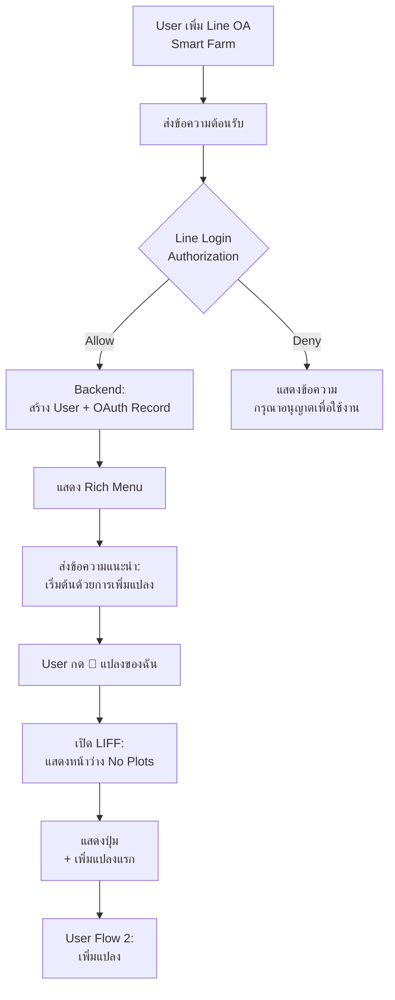
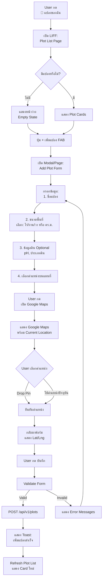
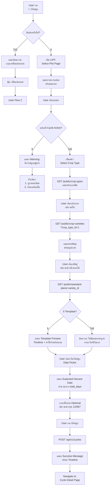
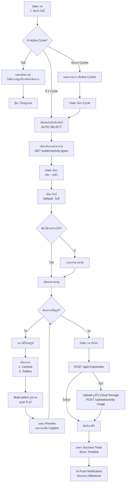
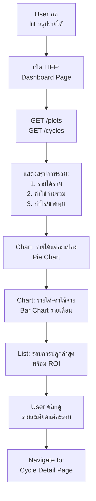

# Smart Farm - UX/UI Flow for Line OA + LIFF

บทความนี้อธิบายรายละเอียด User Experience และ User Interface Flow สำหรับการใช้งานผ่าน Line Official Account และ LIFF (Line Front-end Framework)

---

## Rich Menu Design

### Layout

```
┌──────────────────────┬──────────────────────┐
│   📍 แปลงของฉัน       │   🌱 เริ่มปลูก        │
│   My Plots           │   Start Planting     │
├──────────────────────┼──────────────────────┤
│   📝 บันทึกวันนี้      │   📊 สรุปรายได้       │
│   Log Activity       │   Dashboard          │
├──────────────────────┴──────────────────────┤
│         👤 โปรไฟล์ของฉัน                      │
│         My Profile                          │
└─────────────────────────────────────────────┘
```

### Menu Item Descriptions

| Menu Item | Action | Opens |
|-----------|--------|-------|
| 📍 แปลงของฉัน | เปิด LIFF | หน้ารายการแปลง (Plot List) |
| 🌱 เริ่มปลูก | เปิด LIFF | หน้าเลือกแปลงและเริ่มรอบใหม่ |
| 📝 บันทึกวันนี้ | เปิด LIFF | หน้าบันทึกกิจกรรม (Activity Form) |
| 📊 สรุปรายได้ | เปิด LIFF | Dashboard สรุปรายได้-ค่าใช้จ่าย |
| 👤 โปรไฟล์ | เปิด LIFF | หน้าโปรไฟล์และการตั้งค่า |

---

## User Flow 1: First-Time User (การใช้งานครั้งแรก)



**Welcome Message Example**:
```
🌾 ยินดีต้อนรับสู่ Smart Farm! 🌾

ระบบบริหารจัดการแปลงเกษตรของคุณ

เริ่มต้นง่ายๆ เพียง 3 ขั้นตอน:
1️⃣ เพิ่มแปลงเกษตร
2️⃣ เริ่มรอบการปลูก
3️⃣ บันทึกกิจกรรมรายวัน

กดเมนูด้านล่างเพื่อเริ่มต้น!
```

---

## User Flow 2: เพิ่มแปลงเกษตร



### UI Screens

#### Screen 1: Empty State
```
┌─────────────────────────────────┐
│  📍 แปลงของฉัน                  │
├─────────────────────────────────┤
│                                 │
│        🏞️                       │
│                                 │
│   ยังไม่มีแปลงเกษตร              │
│                                 │
│   เพิ่มแปลงเพื่อเริ่มต้นใช้งาน   │
│                                 │
│  ┌───────────────────────────┐  │
│  │  + เพิ่มแปลงแรก            │  │
│  └───────────────────────────┘  │
│                                 │
└─────────────────────────────────┘
```

#### Screen 2: Plot List (มีข้อมูล)
```
┌─────────────────────────────────┐
│  📍 แปลงของฉัน              [+] │
├─────────────────────────────────┤
│ ┌─────────────────────────────┐ │
│ │ 🌾 แปลงมะม่วง A             │ │
│ │ 2.0 ไร่ • 📍 กรุงเทพฯ       │ │
│ │ กำลังปลูก: มะม่วงน้ำดอกไม้ 🌱│ │
│ │ วันที่ 45 • กำไร -3,300 ฿   │ │
│ └─────────────────────────────┘ │
│ ┌─────────────────────────────┐ │
│ │ 🥬 แปลงผักหลังบ้าน          │ │
│ │ 1.0 งาน • 📍 กรุงเทพฯ       │ │
│ │ ไม่มีการปลูก                │ │
│ └─────────────────────────────┘ │
│                                 │
│  [Floating Action Button +]    │
└─────────────────────────────────┘
```

#### Screen 3: Add Plot Form
```
┌─────────────────────────────────┐
│  ← เพิ่มแปลง                    │
├─────────────────────────────────┤
│                                 │
│ ชื่อแปลง *                      │
│ ┌─────────────────────────────┐ │
│ │ แปลงมะม่วง A                │ │
│ └─────────────────────────────┘ │
│                                 │
│ ขนาดพื้นที่ *                   │
│ ┌───────┬───────┬───────┐      │
│ │  2    │  0    │  0    │      │
│ │ ไร่   │ งาน   │ วา    │      │
│ └───────┴───────┴───────┘      │
│ = 3,200 ตารางเมตร               │
│                                 │
│ ตำแหน่ง (GPS)                   │
│ ┌─────────────────────────────┐ │
│ │ 🗺️ เลือกจากแผนที่            │ │
│ └─────────────────────────────┘ │
│ Lat: 13.7563, Lng: 100.5018    │
│                                 │
│ ข้อมูลดิน (ถ้ามี)               │
│ ┌─────────────────────────────┐ │
│ │ pH: 6.5                     │ │
│ │ ประเภท: ดินร่วน              │ │
│ └─────────────────────────────┘ │
│                                 │
│ ┌─────────────────────────────┐ │
│ │        บันทึก                │ │
│ └─────────────────────────────┘ │
└─────────────────────────────────┘
```

---

## User Flow 3: เริ่มรอบการปลูก



### UI Screens

#### Screen 1: Select Plot
```
┌─────────────────────────────────┐
│  ← เริ่มรอบการปลูก              │
├─────────────────────────────────┤
│ เลือกแปลงที่ต้องการปลูก          │
│                                 │
│ ┌─────────────────────────────┐ │
│ │ ✅ แปลงมะม่วง A             │ │
│ │    2.0 ไร่                  │ │
│ │    ✓ พร้อมใช้งาน             │ │
│ └─────────────────────────────┘ │
│ ┌─────────────────────────────┐ │
│ │ ⚠️ แปลงผักหลังบ้าน           │ │
│ │    1.0 งาน                  │ │
│ │    🌱 กำลังปลูกผักบุ้ง        │ │
│ └─────────────────────────────┘ │
└─────────────────────────────────┘
```

#### Screen 2: Select Crop Type
```
┌─────────────────────────────────┐
│  ← เลือกประเภทพืช                │
├─────────────────────────────────┤
│ แปลง: แปลงมะม่วง A               │
│                                 │
│ ┌──────────┬──────────┐         │
│ │   🍎     │   🥬     │         │
│ │ ผลไม้     │  ผัก     │         │
│ │  15 ชนิด │  25 ชนิด │         │
│ └──────────┴──────────┘         │
│ ┌──────────┬──────────┐         │
│ │   🌸     │   🌾     │         │
│ │ ไม้ดอก   │ พืชไร่    │         │
│ │  8 ชนิด  │  12 ชนิด │         │
│ └──────────┴──────────┘         │
└─────────────────────────────────┘
```

#### Screen 3: Select Variety
```
┌─────────────────────────────────┐
│  ← ผลไม้                        │
├─────────────────────────────────┤
│ 🔍 ค้นหา...                     │
│                                 │
│ ┌─────────────────────────────┐ │
│ │ [🥭 Image]                  │ │
│ │ มะม่วงน้ำดอกไม้              │ │
│ │ 90-120 วัน • 25-35°C        │ │
│ │ ⭐ มีแผนมาตรฐาน              │ │
│ └─────────────────────────────┘ │
│ ┌─────────────────────────────┐ │
│ │ [🍌 Image]                  │ │
│ │ กล้วยน้ำว้า                  │ │
│ │ 300-365 วัน • 20-30°C       │ │
│ │ ⭐ มีแผนมาตรฐาน              │ │
│ └─────────────────────────────┘ │
└─────────────────────────────────┘
```

#### Screen 4: Template Preview
```
┌─────────────────────────────────┐
│  ← แผนปลูกมะม่วง                │
├─────────────────────────────────┤
│ 📋 แผนปลูกมะม่วงแบบมาตรฐาน      │
│                                 │
│ ระยะเวลา: 120 วัน               │
│ ค่าใช้จ่ายประมาณ: 15,000 บาท    │
│                                 │
│ Timeline สำคัญ:                 │
│ ┌─────────────────────────────┐ │
│ │ วันที่ 1  🚜 เตรียมดิน        │ │
│ │ วันที่ 7  🌿 ปลูกกล้า        │ │
│ │ วันที่ 30 🌱 ใส่ปุ๋ย ครั้งที่ 1│ │
│ │ วันที่ 60 🌱 ใส่ปุ๋ย ครั้งที่ 2│ │
│ │ วันที่ 90 ✂️ ตัดแต่งกิ่ง      │ │
│ │ วันที่ 120 🌾 เก็บเกี่ยว       │ │
│ └─────────────────────────────┘ │
│                                 │
│ เลือกวันเริ่มปลูก                │
│ ┌─────────────────────────────┐ │
│ │ 📅 15 มกราคม 2567           │ │
│ └─────────────────────────────┘ │
│ คาดว่าเก็บเกี่ยว: 15 พฤษภาคม    │
│                                 │
│ ┌─────────────────────────────┐ │
│ │      เริ่มปลูก               │ │
│ └─────────────────────────────┘ │
└─────────────────────────────────┘
```

---

## User Flow 4: บันทึกกิจกรรมรายวัน



### UI Screens

#### Screen 1: Activity Form
```
┌─────────────────────────────────┐
│  ← บันทึกกิจกรรม                │
├─────────────────────────────────┤
│ แปลง: แปลงมะม่วง A               │
│ รอบ: มะม่วงรุ่นที่ 1/2567        │
│ วันที่ 45 จาก 120 วัน            │
│                                 │
│ ประเภทกิจกรรม *                 │
│ ┌───┬───┬───┬───┬───┐          │
│ │💧 │🌱 │💉 │🌾 │✂️ │          │
│ │รดน│ใส่│ฉีด│เก็บ│ตัด│          │
│ │้ำ │ปุ๋ย│ยา │เกี่│กิ่│          │
│ │   │   │   │ยว │ง │          │
│ └───┴───┴───┴───┴───┘          │
│                                 │
│ วันที่ *                        │
│ ┌─────────────────────────────┐ │
│ │ 📅 1 มีนาคม 2567            │ │
│ └─────────────────────────────┘ │
│                                 │
│ ค่าใช้จ่าย (บาท)                │
│ ┌─────────────────────────────┐ │
│ │ 0                           │ │
│ └─────────────────────────────┘ │
│                                 │
│ รายได้ (บาท)                    │
│ ┌─────────────────────────────┐ │
│ │ 0                           │ │
│ └─────────────────────────────┘ │
│                                 │
│ หมายเหตุ                        │
│ ┌─────────────────────────────┐ │
│ │ รดน้ำเช้า-เย็น ต้นเริ่มออกดอก│ │
│ └─────────────────────────────┘ │
│                                 │
│ รูปภาพ (สูงสุด 5 รูป)           │
│ ┌─────────────────────────────┐ │
│ │ 📷 อัปโหลดรูป                │ │
│ └─────────────────────────────┘ │
│                                 │
│ ┌─────────────────────────────┐ │
│ │        บันทึก                │ │
│ └─────────────────────────────┘ │
└─────────────────────────────────┘
```

#### Screen 2: Image Upload
```
┌─────────────────────────────────┐
│  ← เลือกรูปภาพ                  │
├─────────────────────────────────┤
│ ┌───────────┬───────────┐       │
│ │ 📷 ถ่ายรูป │ 🖼️ คลังรูป│       │
│ └───────────┴───────────┘       │
│                                 │
│ รูปที่เลือก (2/5)                │
│ ┌───────┬───────┬───────┐       │
│ │ [📷]  │ [📷]  │  [+]  │       │
│ │  ❌   │  ❌   │       │       │
│ └───────┴───────┴───────┘       │
│                                 │
│ Caption รูปที่ 1                │
│ ┌─────────────────────────────┐ │
│ │ ต้นมะม่วงช่วงออกดอก          │ │
│ └─────────────────────────────┘ │
│                                 │
│ Caption รูปที่ 2                │
│ ┌─────────────────────────────┐ │
│ │ ใบสีเขียวสด                  │ │
│ └─────────────────────────────┘ │
│                                 │
│ ┌─────────────────────────────┐ │
│ │      ยืนยัน                  │ │
│ └─────────────────────────────┘ │
└─────────────────────────────────┘
```

---

## User Flow 5: ดู Dashboard



### UI Screen: Dashboard

```
┌─────────────────────────────────┐
│  📊 สรุปรายได้                  │
├─────────────────────────────────┤
│ ภาพรวมทั้งหมด                   │
│ ┌─────────┬─────────┬─────────┐ │
│ │ รายได้   │ ค่าใช้จ่าย│กำไร   │ │
│ │ 45,000  │ 28,000  │17,000  │ │
│ │   ฿     │   ฿     │  ฿     │ │
│ │  +15%   │  +8%    │ +25%   │ │
│ └─────────┴─────────┴─────────┘ │
│                                 │
│ รายได้แต่ละแปลง                 │
│ ┌─────────────────────────────┐ │
│ │   [Pie Chart]               │ │
│ │   แปลงมะม่วง A: 60%         │ │
│ │   แปลงผัก: 40%              │ │
│ └─────────────────────────────┘ │
│                                 │
│ รอบการปลูกล่าสุด                 │
│ ┌─────────────────────────────┐ │
│ │ 🌾 มะม่วงรุ่น 1 (กำลังปลูก)  │ │
│ │    รายได้: 0 ฿              │ │
│ │    ค่าใช้จ่าย: 3,300 ฿       │ │
│ │    🔴 -3,300 ฿              │ │
│ └─────────────────────────────┘ │
│ ┌─────────────────────────────┐ │
│ │ 🥬 ผักบุ้งรอบ 3 (สิ้นสุด)    │ │
│ │    รายได้: 3,500 ฿          │ │
│ │    ค่าใช้จ่าย: 1,200 ฿       │ │
│ │    🟢 +2,300 ฿ (ROI 192%)  │ │
│ └─────────────────────────────┘ │
└─────────────────────────────────┘
```

---

## Chatbot Interactions

### ใช้ Chatbot สำหรับ:

1. **การแจ้งเตือน (Push Notifications)**
2. **Quick Actions**
3. **FAQ**

### Example: Push Notification

```
🔔 แจ้งเตือน Smart Farm

ถึงเวลาใส่ปุ๋ยแล้ว! 🌱

แปลง: แปลงมะม่วง A
รอบ: มะม่วงรุ่นที่ 1/2567
วันที่ 30: ใส่ปุ๋ยครั้งที่ 1

ตามแผนมาตรฐาน ควรใส่:
ปุ๋ยเคมีสูตร 15-15-15

[บันทึกการใส่ปุ๋ย]
```

### Example: Quick Reply

```
User: สรุปรายได้เดือนนี้

Bot: 📊 สรุปรายได้เดือน มีนาคม 2567

รายได้: 8,500 บาท
ค่าใช้จ่าย: 3,200 บาท
กำไร: 5,300 บาท ✅

ต้องการดูรายละเอียด?
[ดูรายละเอียด] [ส่งออก PDF]
```

---

## Technical Implementation Notes

### LIFF Configuration

```javascript
// liff.init()
liff.init({
  liffId: '1234567890-abcdefgh'
}).then(() => {
  if (!liff.isLoggedIn()) {
    liff.login();
  } else {
    // Get user profile
    liff.getProfile().then(profile => {
      // Send to backend for authentication
      authenticateUser(profile);
    });
  }
});
```

### Google Maps Integration

```javascript
// Load Google Maps
<script src="https://maps.googleapis.com/maps/api/js?key=YOUR_API_KEY"></script>

// Initialize map
const map = new google.maps.Map(document.getElementById('map'), {
  center: { lat: 13.7563, lng: 100.5018 },
  zoom: 15
});

// Add marker on click
map.addListener('click', (e) => {
  placeMarker(e.latLng);
});
```

### Image Compression (Before Upload)

```javascript
import imageCompression from 'browser-image-compression';

const options = {
  maxSizeMB: 1,
  maxWidthOrHeight: 1920,
  useWebWorker: true
};

const compressedFile = await imageCompression(imageFile, options);
```

---

## Performance Optimization

### 1. Lazy Loading Images
- ใช้ `loading="lazy"` สำหรับรูปภาพใน List
- ใช้ Thumbnail สำหรับ Preview

### 2. Caching
- Cache Master Data (crop types, varieties) ใน LocalStorage
- ระยะเวลา: 24 ชั่วโมง

### 3. Offline Support (Future)
- ใช้ Service Worker
- Cache LIFF App Shell
- Sync ข้อมูลตอน Online

---

## Accessibility Considerations

1. **Font Size**: ขนาดตัวอักษรอย่างน้อย 16px
2. **Touch Targets**: ปุ่มขนาดอย่างน้อย 44x44px
3. **Color Contrast**: WCAG AA compliance
4. **Loading States**: แสดง Skeleton/Spinner เมื่อโหลดข้อมูล
5. **Error Messages**: ข้อความชัดเจน เป็นภาษาไทย

---

## Security Best Practices

1. **JWT Validation**: ตรวจสอบ Token ทุก API Request
2. **Input Sanitization**: ป้องกัน XSS, SQL Injection
3. **File Upload Validation**: ตรวจสอบ MIME Type และขนาดไฟล์
4. **HTTPS Only**: ไม่อนุญาตให้ใช้ HTTP
5. **CORS Policy**: จำกัด Origin ที่อนุญาต
